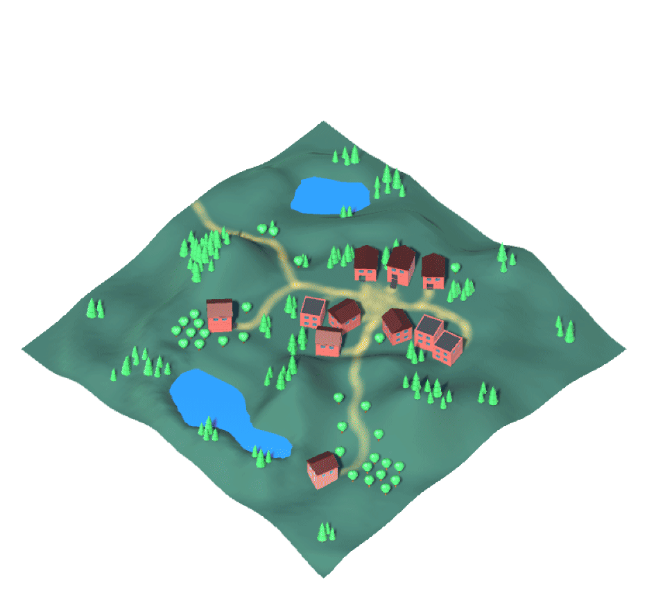
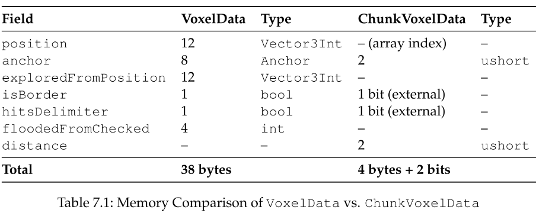
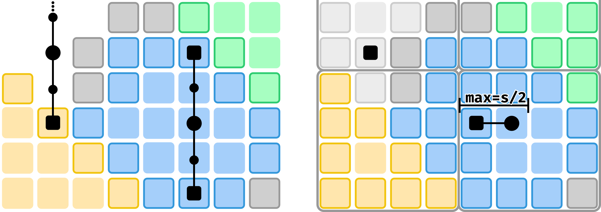
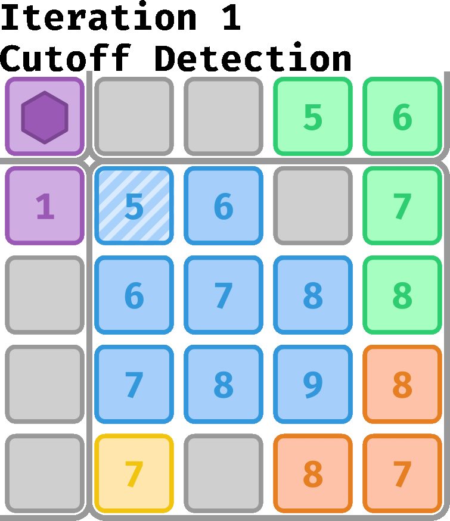

# Enhancing Performance and Scalability of the Space Foundation System (SFS)

This repository contains selected excerpts of my implementation work for my master’s thesis, which focused on **optimizing the Space Foundation System (SFS)**—a designer-centric spatial abstraction for game worlds—through **chunking and parallelization**.
The SFS builds semantically meaningful regions via a voxelized, multi-seed flood-fill; my task was to make this process scalable and performant for large scenes.

> **Note:** This repository contains only parts of the original implementation. Many dependencies are intentionally omitted; the code is not expected to compile. Its purpose is to showcase my contribution, architecture, and optimization work.

  
  

<em>Chunked Parallel Algorithm running on the Villa and Region scenes.</em>

---

## Summary of My Contribution

* **Designed a fully chunked SFS architecture** enabling independent spatial regions with deterministic merging at chunk borders.
* **Parallelized the generation algorithm** using Unity’s **C# Job System** and **Burst Compiler**, restructuring all relevant data into blittable, job-compatible formats.
* **Implemented a new voxel data layout**, reducing memory footprint and improving cache locality.
* **Developed cutoff-voxel detection & correction**, ensuring correctness despite parallel processing.
* **Optimized runtime queries** so that lookup cost becomes effectively constant when chunks are cached.
* **Improved serialization and data storage** for scalable Editor-time generation.

<figure>
  
  <figcaption><em>Memory Comparison of VoxelData (original, 38 B) vs. ChunkVoxelData (new, 4.25 B).</em></figcaption>
</figure>

<figure>
  
  <figcaption><em>Sequential (left) vs. parallel (right) runtime queries. The parallel method requires only a single ray toward the nearest chunk border, with at most half the chunk size in steps, and handles empty space efficiently with dedicated anchors—at the cost of a higher memory footprint.</em></figcaption>
</figure>

<figure>
  
  <figcaption><em>Cutoff removal process: detection of a Bluecutoff voxel, removal of its volume via BFS, refilling of the affected chunk, and the intermediate result after refilling.</em></figcaption>
</figure>

---

## Benchmarks (Excerpt)

Benchmarks were performed across several scenes and resolutions:

* **Up to 71× faster SFS creation** compared to the sequential version.
* **500×+ faster runtime spatial queries** when relevant chunks reside in memory.
* **Near-linear scaling** with increasing CPU cores due to independent per-chunk work.
* **Significant additional gains** when enabling Burst compilation.

These results demonstrate that the chunked, parallel algorithm makes SFS practical for worlds that previously caused the sequential version to stall or exceed memory limits.

<figure>
  
  <figcaption><em>Mean SFS creation times (ms) and corresponding speedups for different scenes, along with processed voxel counts and algorithm iterations (voxel size 0.25, chunk size 16).</em></figcaption>
</figure>

---

## Algorithm Overview

### 1. Chunk Partitioning

The voxel domain is split into fixed-size chunks. Each chunk runs flood-fill expansion locally and maintains its own frontier, discovered voxels, and border metadata.

### 2. Parallel Flood-Fill

Each chunk is processed in parallel using jobified voxel exploration kernels.
All per-voxel data structures are contiguous and blittable, enabling Burst to auto-vectorize inner loops.

### 3. Cutoff Voxel Handling

Because chunk-local BFS waves can meet prematurely, a deterministic cutoff-detection pass removes invalid expansions and re-grows affected regions.
This guarantees equivalence to the sequential reference algorithm.

### 4. Border Resolution

Neighboring chunks exchange border data to ensure consistent region labels.
Conflicts are resolved using distance ordering and explicit delimiter checks.

### 5. Runtime Queries

At runtime, only relevant chunks are loaded.
Queries perform a small set of voxel lookups, achieving constant-time behavior independent of world size.
